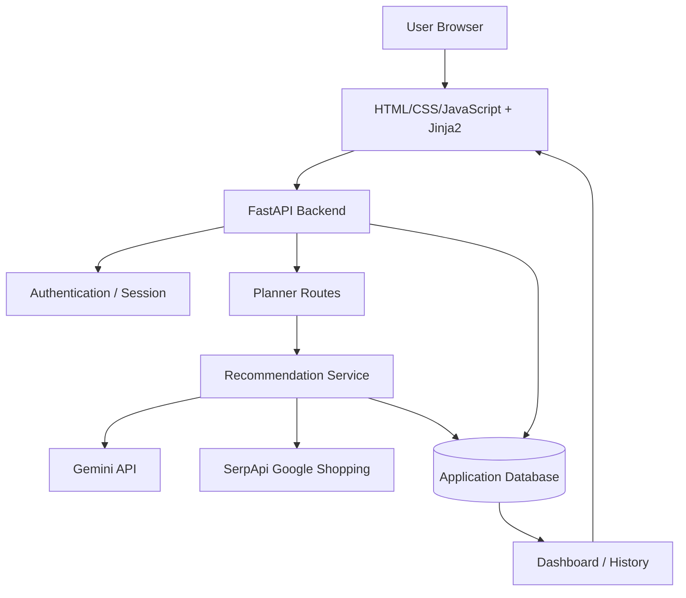

# PocketSmart AI – System Architecture

Project: **PocketSmart AI – Your Smart Budget & Recommendation Assistant**

## Architecture

```mermaid
flowchart TD
U[User Browser] --> UI[HTML/CSS/JavaScript + Jinja2]
UI --> API[FastAPI Backend]
API --> AUTH[Authentication / Session]
API --> PLAN[Planner Routes]
PLAN --> REC[Recommendation Service]
REC --> GEM[Gemini API]
REC --> SHOP[SerpApi Google Shopping]
API --> DB[(Application Database)]
REC --> DB
DB --> DASH[Dashboard / History]
DASH --> UI
```

